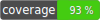

Olifanton PHP utils library
---



[](https://packagist.org/packages/olifanton/utils)
[](https://packagist.org/packages/olifanton/utils)

PHP port of [`tonweb-utils`](https://github.com/toncenter/tonweb/tree/master/src/utils) JS library

## Installation

```bash
composer require olifanton/utils
```

## Documentation

### Getting started

Install [`olifanton/utils`](https://packagist.org/packages/olifanton/utils) package via Composer and include autoload script:

```php
<?php declare(strict_types=1);

require __DIR__ . "/vendor/autoload.php";

use Olifanton\Utils\Address;
use Olifanton\Utils\Bytes;
use Olifanton\Utils\Crypto;
use Olifanton\Utils\Units;

// Now you can use Olifanton utils classes

```

### Library classes

- [Address](https://github.com/olifanton/utils#olifantonutilsaddress)
- [Bytes](https://github.com/olifanton/utils#olifantonutilsbytes)
- [Crypto](https://github.com/olifanton/utils#olifantonutilscrypto)
- [Units](https://github.com/olifanton/utils#olifantonutilsunits)

---

#### `Olifanton\Utils\Address`

`Address` is a class that allows you to work with smart contract addresses in the TON network. Read more about Addresses in official [documentation](https://ton.org/docs/learn/overviews/addresses).

##### _Address_ constructor

```php
/**
 * @param string | \Olifanton\Utils\Address $anyForm
 */
public function __construct(string | Address $anyForm)
```

Parameters:

- `$anyForm` &mdash; Address in supported form. Supported values are:
    - Friendly format (base64 encoded, URL safe or not): `EQBvI0aFLnw2QbZgjMPCLRdtRHxhUyinQudg6sdiohIwg5jL`;
    - Raw form: `-1:fcb91a3a3816d0f7b8c2c76108b8a9bc5a6b7a55bd79f8ab101c52db29232260`;
    - Other `Address` instance, in this case the new instance will be an immutable copy of the other address.

Depending on the passed value, the Address instance will store information about the input address flags.

If the input value is not a valid address, then `\InvalidArgumentException` will be thrown.

##### _Address_ static methods

###### isValid(string | \Olifanton\Utils\Address $anyForm): bool
Checks if the passed value is a valid address in any form.

##### _Address_ methods

###### toString(): string
```php
/**
 * @param bool|null $isUserFriendly User-friendly flag
 * @param bool|null $isUrlSafe URL safe encoded flag
 * @param bool|null $isBounceable Bounceable address flag
 * @param bool|null $isTestOnly Testnet Only flag
 */
public function toString(?bool $isUserFriendly = null,
                         ?bool $isUrlSafe = null,
                         ?bool $isBounceable = null,
                         ?bool $isTestOnly = null): string
```
Returns a string representation of Address.

If all parameters are left as default, then the address will be formatted with the same flags whose value was recognized in the constructor.

###### getWorkchain(): int
Returns Workchain ID. Returns `-1` for Masterchain and `0` for basic workchain.

###### getHashPart(): Uint8Array
Returns address Account ID.

###### isTestOnly(): bool
Returns true if the address has the `isTestnetOnly` flag.

###### isBounceable(): bool
Returns true if the address has the `isBounceable` flag.

###### isUserFriendly(): bool
Returns true if the address is user-friendly.

###### isUrlSafe(): bool
Returns true if the address was encoded with URL-safe characters only.

---

#### `Olifanton\Utils\Bytes`
This is a helper class for working with Uint8Array. You are unlikely to use this class directly because it is designed to handle the internal representation of Cells. However, this documentation describes the methods that you may find useful.

##### _Bytes_ static methods

###### readNBytesUIntFromArray(): int
Returns $n bytes from Uint8Array.

###### compareBytes(): bool
Returns true if Uint8Array's $a and $b are equal.

###### arraySlice(): Uint8Array
Returns an immutable fragment from the given Uint8Array.

###### concatBytes(): bool
Returns a new Uint8Array from the given ones.

###### concatBytes(): Uint8Array
Returns a new Uint8Array from the given ones.

###### stringToBytes(): Uint8Array
Returns a Uint8Array from a PHP byte string.

Example:

```php
$a = \Olifanton\Utils\Bytes::stringToBytes('a');
$a[0] === 97; // True, because the ASCII code of `a` is 97 in decimal
```

###### hexStringToBytes(): Uint8Array
Returns a Uint8Array from a hexadecimal string.

Example:

```php
$a = \Olifanton\Utils\Bytes::hexStringToBytes('0a');
$a[0] === 10; // True
```

###### bytesToHexString(): string
Returns a hexadecimal string representation of the Uint8Array.

Example:

```php
$s = \Olifanton\Utils\Bytes::bytesToHexString(new \ajf\TypedArrays\Uint8Array([10]));
$s === '0a'; // True
```

---

#### `Olifanton\Utils\Crypto`

##### _Crypto_ methods

`@TODO`

---

#### `Olifanton\Utils\Units`

##### _Units_ methods

`@TODO`

---

## Tests

```bash
composer run test
```

---

# License

MIT
